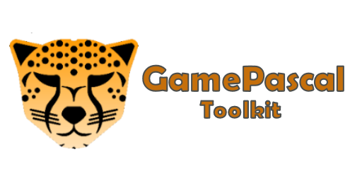

   

## Overview
Gamedev + Pascal Compiler as a Service = GamePascal Toolkit! Coming 🔜™ 

It should be able to work with all versions of Delphi/FreePascal that can target win64 and should be able to work on older Windows OSes (possibly low as 7).

https://user-images.githubusercontent.com/69952438/211323153-a0480afd-70fb-43ab-ae96-52d1a4edebf2.mp4

